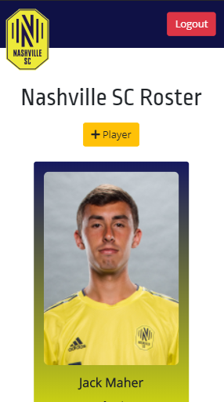

# Sports Roster
## Technology
- JavaScript
- React.js
- React Responsive
- ES6 Modules
- Bootstrap

## Features
Simple CRUD (Create, Read, Update, Delete) site for user to keep track of the Nashville MLS team's players.

Utitlizes 'react-responsive' for mobile friendly navbar.

## Screenshots
#### Players Page

#### New Player Form

#### Edit Player Form

#### Responsive Design

## How To Run
1. Clone down this repo
1. Make sure you have  http-serve installed via npm. If not, get it [HERE](https://npmjs.com/package/http-server).
1. On your command line run `hs -p 9999`
1. In your browser go to `http://localhost:9999`

## Contributors
* Joey Petrone - [joeydev.net](https://joeydev.net)
